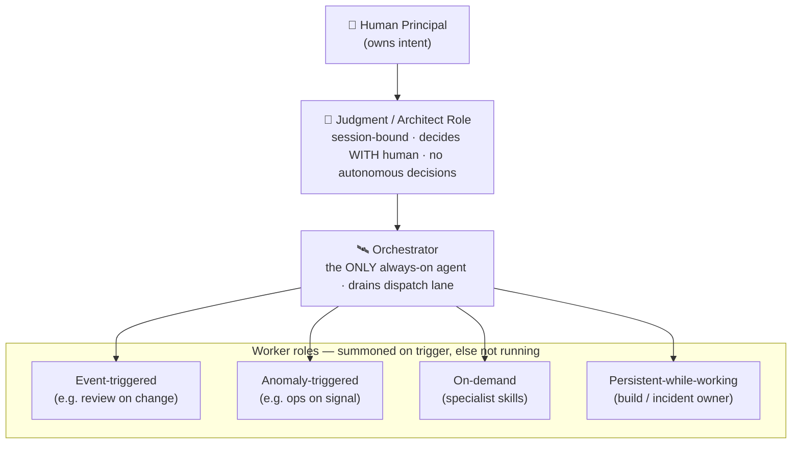
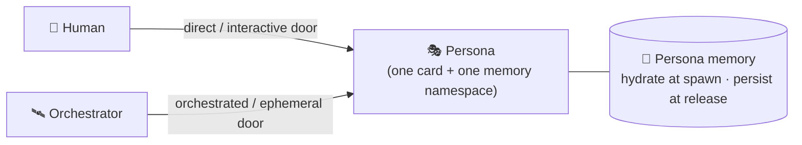
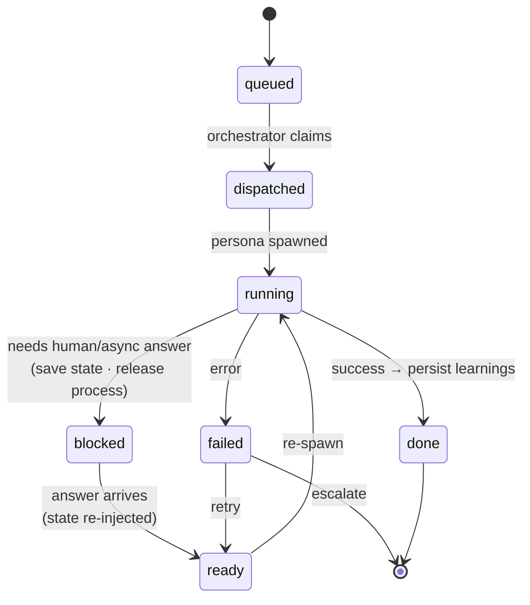
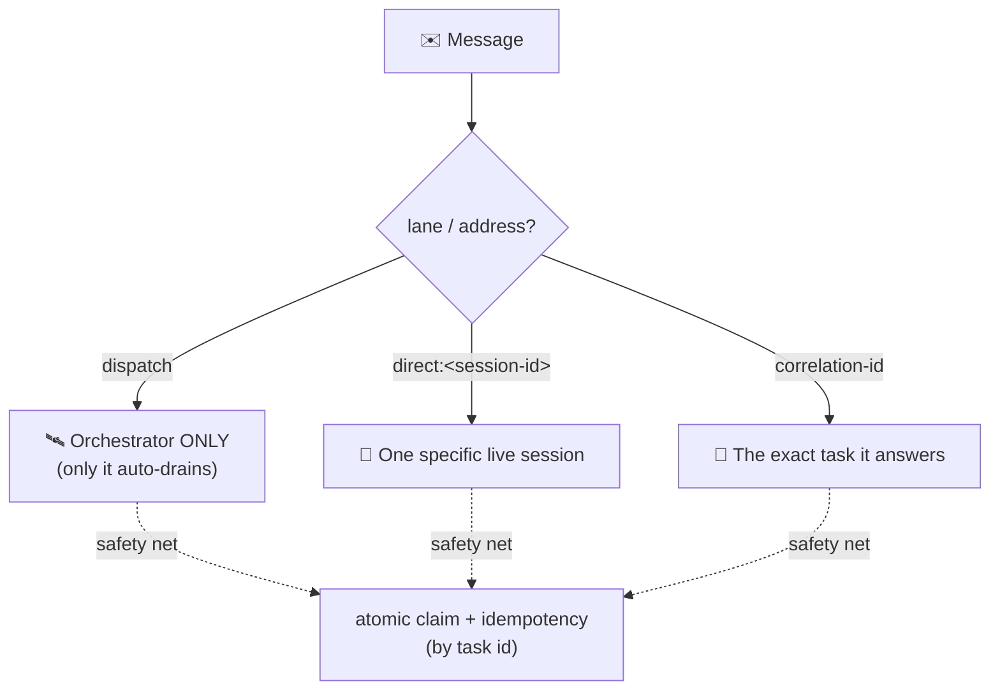

# The Agent Operating Model — One-Page Diagram

> Author: **Eugene Calalang** · 2026-06-23 · Diagrams render natively on GitHub (Mermaid).

## A. Chain of command & roles

## B. Two doors into one persona

## C. Task lifecycle (durable; process is ephemeral)

## D. Lane addressing — exactly one consumer per message

---

**The eight invariants:** ① one auto-drainer per lane (orchestration may nest) · ② never block a
process on an async/human dependency — park the task · ③ exactly one consumer per message · ④ only
the orchestrator auto-drains dispatch · ⑤ memory & journals belong to persona/task, never the
process · ⑥ engine is generic, identity lives in the card · ⑦ autonomy bounded by an explicit
chain of command · ⑧ supervision is free, spend is budgeted, confidential roles are
residency-pinned.

---

© 2026 Eugene Calalang. All rights reserved.
